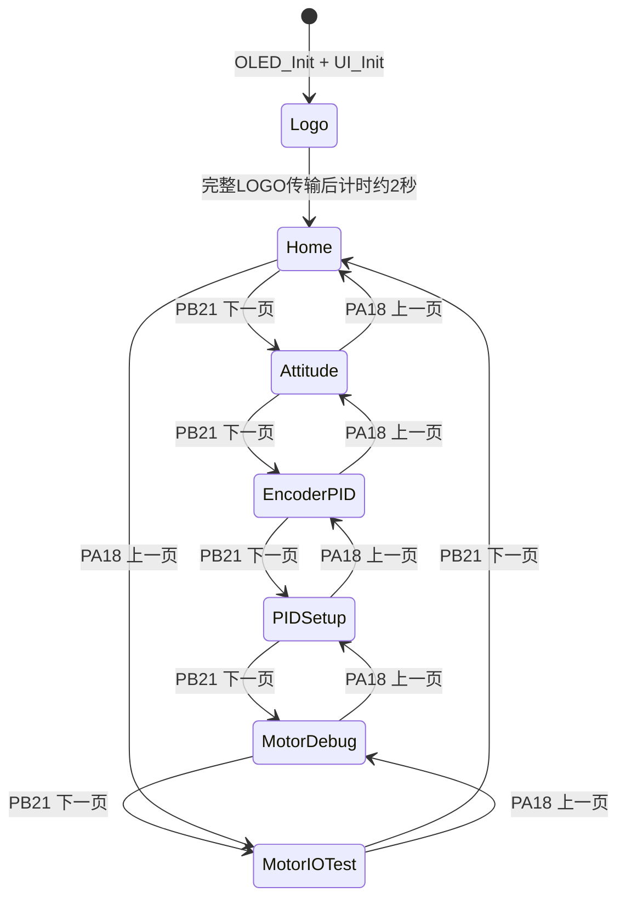

# OLED 页面控制状态机



LOGO 阶段忽略翻页事件。2 秒从 LOGO 的 1024 字节完整发送到面板后开始计，不会因为分块刷新而缩短可见时间。ICM42688 校准、编码器计数和控制调度在 LOGO 期间继续运行。

## 页面内容

### 第 1 页：Home

- System：RUN/STOP；
- ICM42688：STARTING/READY/FAILED；
- Encoder：READY/FAILED；
- 车体中心累计路程；
- 两轮实时平均速度和目标速度；
- 电机控制 ENABLED/SAFE OFF。

### 第 2 页：ICM42688

正常时显示：

```text
ICM42688
Roll : XX.XX
Pitch: XX.XX
Yaw  : XX.XX
```

初始化或校准失败时显示 `Init Failed` 和 `--`。校准期间显示 `Calibrating...`，而不是误报失败。

### 第 3 页：Encoder / PID

依次显示真实的两轮平均速度、可调目标速度、可调目标距离、车体中心累计路程和左右轮累计计数。五向上/下在目标速度与目标距离之间选择，选中项前显示 `*`；五向左/右按对应步长减少/增加，修改先保存在 OLED 草稿中，下次启动电机测试或长按保存时应用。

编码器配置成功且控制关闭/低输出时，计数为 0 仍显示 READY 和 0，含义是“当前静止”。只有模块未初始化才显示 `Encoder Init Failed`。控制已启用且 PWM 达到 150/999 后，任一侧连续 1 秒没有边沿会显示 `Encoder NoSig: LEFT/RIGHT/BOTH`；目标与反馈持续异号 500 ms 则显示 `Encoder Dir: LEFT/RIGHT/BOTH`。两种故障都会锁存安全停机，需人工检查后复位。

### 第 4 页：Speed PID Setup

- Kp、Ki、Kd 均显示当前编辑草稿；
- 五向上/下选择参数，选中参数前显示 `*`；
- 五向左/右按配置步长减小/增大，且受安全范围限幅；
- 五向中键长按约 1 秒后，把目标速度、目标距离、Kp/Ki/Kd 和电机模式一起应用并写入 W25Q64；复位或断电后自动恢复最近一次有效记录。

### 第 5 页：Motor Debug

- 模式一 `DISTANCE`：按当前目标速度行驶，到达从启动点计算的目标距离后自动停车；
- 模式二 `LINE`：读取完整 P1～P12 灰度阵列，按 r2 加权误差与 PD 逻辑修正左右速度目标，同时在达到目标距离后停车；
- 电机停止时用五向左/右切换模式；
- 短按五向中键启动/停止。启动只在第 5 页接受，但运行中可在任意页面短按中键停止；
- 丢线持续约 500 ms、编码器无反馈或配置非法时进入故障并关闭速度 PID。

### 第 6 页：Motor IO Test

- 上/下键分别输出物理 A+/A−，右/左键分别输出物理 B+/B−；
- 输出固定为 350/999，每次最多持续 2 秒；中键和切页均立即停止；
- 页面实时显示本次测试的左、右编码器增量 `dL`/`dR`；
- 测试绕过车辆左右电机极性和速度 PID，但保留原编码器采样代码；
- 测试期间 DIR/NoSig 计时器不累计，退出后原故障锁存和保护继续有效。

## 消抖、翻页和保存

- 每 10 ms 扫描；
- 连续 3 个样本一致后改变稳定状态；
- PA18/PB21 和五向方向键在“稳定释放→稳定按下”时立即产生一次边沿事件；
- 五向上/下/左/右持续按住 500 ms 后每 100 ms 产生独立连发事件，第 3、4 页把它转换为选择或参数增减；
- PA18/PB21 不连发；第 5 页模式切换和第 6 页物理 IO 测试忽略连发事件，仍然一次按下一次动作；
- 中键短按事件在释放时产生，用于电机调试启停；长按达到阈值只产生一次保存事件，释放后不会再补发短按，因此保存不会误启动电机。

## 无闪烁刷新

绘图函数只写 1024 字节 framebuffer。`UI_Service()` 仅在上一帧发送完成后构造下一帧，随后由 `OLED_Process()` 每次发送 8 字节。页面切换立即标记待刷新，但不会覆盖正在发送的 framebuffer；周期刷新为 100 ms 请求，实际提交受上一帧完成时间约束。
